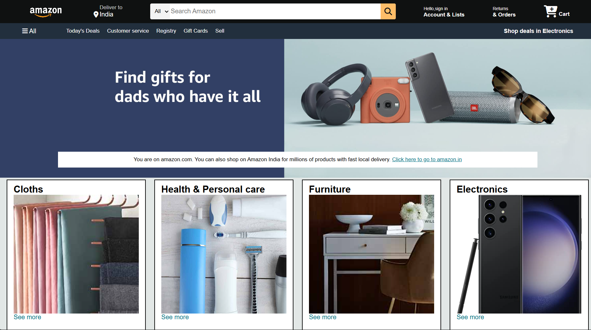
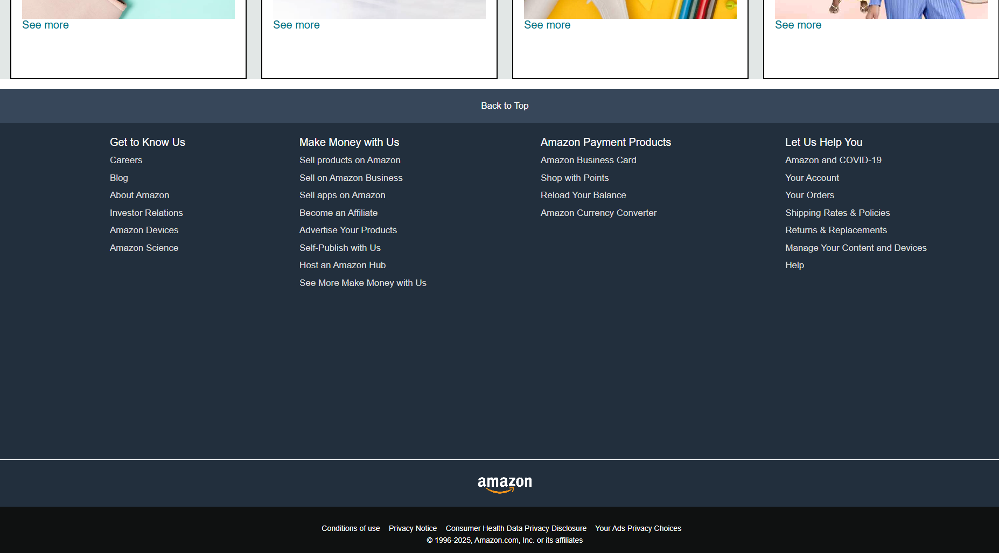

# Amazone_clone_Miny_project_frontend
a front-end-only replica of the popular e-commerce platform Amazon, built entirely using HTML and CSS. This project is designed to mimic the visual layout, structure, and user interface of the Amazon homepage while focusing on practicing core web development skills without using any JavaScript or frameworks

# 🛒 Amazon Clone - HTML & CSS

This is a **front-end clone of the Amazon homepage** created using **HTML5** and **CSS3**.  
The project focuses on replicating Amazon’s visual layout and structure without any JavaScript or backend. It’s a great way to practice responsive design and CSS techniques like Flexbox and Grid.

---

## ✨ Features

- Responsive design that adapts to different screen sizes  
- Navigation bar with search input and icons  
- Hero section with promotional banners  
- Product grid showcasing various product cards  
- Footer with multiple informational links  
- Clean and well-organized HTML & CSS code  
- Built purely with semantic HTML and modern CSS

---

## 📸 Assets

### top view 
  

##bottem view

---

## 🧱 Technologies Used

- HTML5  
- CSS3 (Flexbox, Grid)

No JavaScript or frameworks used in this version.
---

